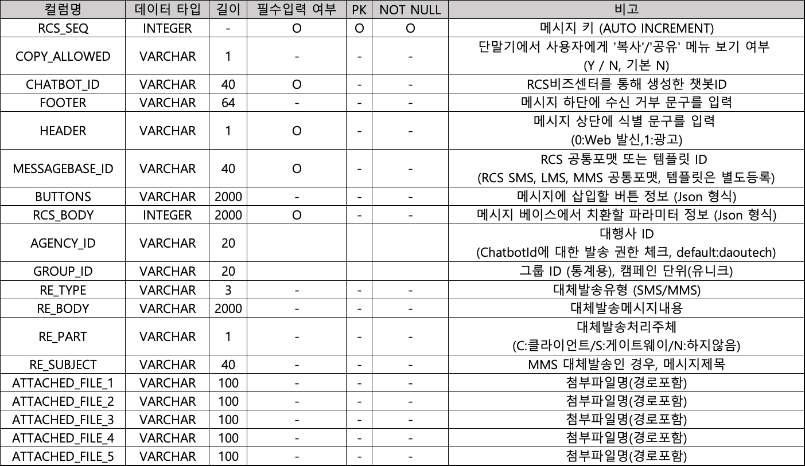

# RCS

RCS는 사용 가능한 챗봇ID와 메시지베이스ID를 사용하여 발송되며 RCS 지원기기 사용자인 경우 발송 가능합니다.

메시지베이스 ID 는 이통사에서 제공하는 **메시지 포맷**을 사용하거나 **\*\[RCS 비즈센터]**을 통해 **템플릿**을 등록하여 사용가능합니다.

```sql
INSERT INTO EM_TRAN_RCS(
CHATBOT_ID, HEADER, MESSAGEBASE_ID, RCS_BODY)
VALUES ({챗봇 ID}, 0, 'SS000000', '{"description":"안녕하세요"}');

INSERT INTO EM_TRAN(
TRAN_PHONE, TRAN_CALLBACK, TRAN_STATUS, TRAN_DATE, TRAN_TYPE, TRAN_ETC4) 
VALUES ('01000000000', '01000000000', '1', NOW(), 11, {EM_TRAN_RCS 의 RCS_SEQ 값});
```

### RCS 공통포맷 (MESSAGEBASE\_ID)

.png>)

> **RCS MMS 슬라이드형(Carousel Medium, Small)은 1,300자까지 발송 가능하나 실제 단말에서 수신 가능한 글자 수가 적어 메시지 내용이 잘려 발송될 수 있습니다.**
>
> **수신 가능한 글자 수는 포토여부/타이틀 글자 수/버튼 개수에 따라 다릅니다.**

> **RCS MMS 슬라이드형 글자/ 라인수 정의**&#x20;
>
> 글자 수 : 1줄 당 정상적으로 표현가능한 글자 수, 한글 **'**가' 기준 측정
>
> 라인 수 : 수신 가능한 디스크립션(본문) 줄 수

**MMS (Carousel Medium - 슬라이드 형)**

.png>)

.png>)

**MMS (Carousel Small - 슬라이드 형)**



.png>)

### RCS BODY

**BODY**

**key : title, media, description**

리치카드 개수 및 순서에 따라 넘버링 (ex. title1, title2, ...)

```sql
#1개
{
    "title" : "카드",
    "media" : "등록된 이미지 URL", 
    "description": "안녕하세요!"
}
```

```sql
#2개 이상
{
    "title1" : "카드",
    "media1" : "등록된 이미지 URL", 
    "description1": "안녕하세요!", 
    "title2" : "카드 2",
    "media2" : "등록된 이미지 URL", 
    "description2" : "안녕하세요!",
            .
            .
            .
}
```

**신규 RCS 포맷**

```json5
"body": {
    "title1": "제목",
    "description1": "본문 텍스트",
    "media1": "maapfile://{fileId_1}",
    "title2": "제목 2번째 카드",
    "description2": "본문 텍스트",
    "media2": "maapfile://{fileId_2}",
    "title3": "제목 3번째 카드",
    "description3": "본문 텍스트",
    "media3": "maapfile://{fileId_3}",
    "media": "maapfile://{fileId_main}      > (신규포맷 mms 전용) 상단 main 이미지",
    "title": "제목 텍스트                   > (신규포맷 mms 전용) 상단 main 제목",
    "description": "본문 텍스트             > (신규포맷 mms 전용) 상단 main 본문",
    "subMedia1": "maapfile://{fileId_sub1}  > (신규포맷 mms 전용) 선택 옵션 서브 이미지 1",
    "subMediaUrl1": "URL                    > (신규포맷 mms 전용) 선택 옵션 서브 이미지 1 클릭 시 랜딩 URL",
    "subTitle1": "제목 텍스트               > (신규포맷 mms 전용) 선택 옵션 소제목 1",
    "subDesc1": "본문 텍스트                > (신규포맷 mms 전용) 선택 옵션 소본문 1",
    "subMedia2": "maapfile://{fileId_sub2}  > (신규포맷 mms 전용) 선택 옵션 서브 이미지 2",
    "subMediaUrl2": "URL                    > (신규포맷 mms 전용) 선택 옵션 서브 이미지 2 클릭 시 랜딩 URL",
    "subTitle2": "제목 텍스트               > (신규포맷 mms 전용) 선택 옵션 소제목 2",
    "subDesc2": "본문 텍스트                > (신규포맷 mms 전용) 선택 옵션 소본문 2",
    "subMedia3": "maapfile://{fileId_sub3}  > (신규포맷 mms 전용) 선택 옵션 서브 이미지 3",
    "subMediaUrl3": "URL                    > (신규포맷 mms 전용) 선택 옵션 서브 이미지 3 클릭 시 랜딩 URL",
    "subTitle3": "제목 텍스트               > (신규포맷 mms 전용) 선택 옵션 소제목 3",
    "subDesc3": "본문 텍스트                > (신규포맷 mms 전용) 선택 옵션 소본문 3"
 }
```

###

### Media 종류

**이미지**

*   비즈뿌리오 사이트의 \[메시지관리] – \[RCS 관리] – \[RCS 이미지 관리] 메뉴에서 이미지를 등록하여 사용합니다.

    이미지는 등록일로부터 365일간 발송 가능합니다. (이후 자동 삭제)

> **이미지 URL**
>
> **포맷**&#x20;
>
> maapfile://{fileId}
>
> &#x20;
>
> **예시**&#x20;
>
> "media" : "maapfile://BR.i6dOpSm8N8.20200302150000.001"


**동영상 스트리밍**

> **동영상 스트리밍 URL**
>
> **포맷**&#x20;
>
> https://www.youtube.com/watch?v=\[videoId],maapfile://{썸네일용 fileId\_1}
>
> https://youtu.be/\[VideoId],maapfile://{썸네일용 fileId\_2}
>
> https://m.youtube.com/watch?v=\[videoId],maapfile://{썸네일용 fileId\_3}
>
> &#x20;
>
> **예시**&#x20;
>
> "media1" : "https://www.youtube.com/watch?v=KCbtF9I0qvI,maapfile://BR.i6dOpSm8N8.20200302150000.001"


****

> RCS MMS 슬라이드형(Carousel Medium, Small)은 1,300 자까지 발송 가능하나\
> 실제 단말에서 수신 가능한 글자 수가 적어 메시지 내용이 잘려 발송될 수 있습니다.\
> 포토여부/타이틀 글자 수/버튼 개수에 따라 입력 가능한 본문 글자 수가 상이할 수 있습니다.

### RCS + BUTTONS

RCS 에 버튼 링크를 추가하고자 할 경우 아래와 같은 JSON 형식에 맞춰 RCS 테이블(BIZ\_RCS)의 **BUTTONS** 필드에 입력합니다.

```sql
INSERT INTO EM_TRAN_RCS(
CHATBOT_ID, HEADER, MESSAGEBASE_ID, RCS_BODY, BUTTONS)
VALUES ({챗봇 ID}, 0, 'SS000000', '{"description":"안녕하세요"}', '{버튼 예시 참조}');

INSERT INTO EM_TRAN(
TRAN_PHONE, TRAN_CALLBACK, TRAN_STATUS, TRAN_DATE, TRAN_TYPE, TRAN_ETC4) 
VALUES ('01000000000', '01000000000', '1', NOW(), 11, {EM_TRAN_RCS 의 RCS_SEQ 값});
```

### RCS + 1차 대체 발송

RCS 는 발송결과에 대해 실패가 발생할 경우, 대체발송이 가능합니다.

단, 해당 서비스 아이디에 대해 대체발송 가능여부와 주체에 대한 설정이 되어있어야 합니다.\
대체발송의 경우, EM\_TRAN 테이블에 해당 레코드가 추가로 생성되며 SMS 의 TRAN\_TYPE 은 1 이고 MMS 의 TRAN\_TYPE 은 2 이며, TRAN\_ETC4 에 입력된 값이 실제 원본데이터의 TRAN\_PR 입니다.

#### **RCS+SMS**

```sql
INSERT INTO EM_TRAN_RCS(
CHATBOT_ID, HEADER, MESSAGEBASE_ID, RCS_BODY, RE_TYPE, RE_BODY)
VALUES (
{챗봇 ID}, 0, 'SS000000', '{"description":"RCS+SMS 대체발송"}' 'SMS', '대체발송');

INSERT INTO EM_TRAN(
TRAN_PHONE, TRAN_CALLBACK, TRAN_STATUS, TRAN_DATE, TRAN_TYPE, TRAN_ETC4) 
VALUES (
'01000000000', '01000000000', '1', now(), 11, {EM_TRAN_RCS 의 RCS_SEQ});
```

**RCS + MMS**

```sql
INSERT INTO EM_TRAN_KKO(
CHATBOT_ID, HEADER, MESSAGEBASE_ID, RCS_BODY, RE_TYPE, RE_BODY) 
VALUES (
{챗봇 ID}, 0, 'SS000000', '{"description":"RCS+MMS 대체발송"}',
'MMS', '대체발송', 'D:/spool/mms.jpg'); 

INSERT INTO EM_TRAN(
TRAN_PHONE, TRAN_CALLBACK, TRAN_STATUS, TRAN_DATE, TRAN_TYPE, TRAN_ETC4) 
VALUES ('01000000000', '01000000000', '1', now(), 11, {EM_TRAN_RCS 의 RCS_SEQ});
```

### RCS + 1차 + 2차 대체발송

RCS 는 발송결과에 대해 실패가 발생할 경우, 최대 2 차 대체발송이 가능합니다. - 대체발송의 경우, EM\_TRAN 테이블에 해당 레코드가 추가로 됩니다.

* 발송에 사용되는 RCS\_SEQ 값과 KKO\_SEQ 값은 동일해야 합니다.
* 2 차 대체(SMS/MMS)의 정보는 KKO 테이블에 입력해야 정상적으로 발송됩니다.

**RCS + AT + SMS**

```sql
INSERT INTO EM_TRAN_RCS(
RCS_SEQ, CHATBOT_ID, HEADER, MESSAGEBASE_ID, RCS_BODY, RE_TYPE) 
VALUES ({RCS_SEQ}, {챗봇 ID}, 0, 'SS000000', '{"description":"RCS 메시지"}', 'K');

INSERT INTO EM_TRAN_KKO(
KKO_SEQ, SENDER_KEY, TEMPLATE_CODE, NATION_CODE, MESSAGE, RE_TYPE, RE_BODY) 
VALUES ({RCS_SEQ 동일}, {발신 프로필 키}, {템플릿 코드}, '82', 'RCS+AT+SMS 대체발송',
'SMS', 'SMS 2 차 대체발송 메시지'); 

INSERT INTO EM_TRAN(
TRAN_PHONE, TRAN_CALLBACK, TRAN_STATUS, TRAN_DATE, TRAN_TYPE, TRAN_ETC4) 
VALUES ('01000000000', '01000000000', '1', now(), 11, {EM_TRAN_RCS 의 RCS_SEQ});
```

**RCS + AT + MMS**

```sql
INSERT INTO EM_TRAN_RCS(
RCS_SEQ, CHATBOT_ID, HEADER, MESSAGEBASE_ID, RCS_BODY, RE_TYPE) 
VALUES ({RCS_SEQ}, {챗봇 ID}, 0, 'SS000000', '{"description":"RCS 메시지"}', 'K');

INSERT INTO EM_TRAN_KKO(
KKO_SEQ, SENDER_KEY, TEMPLATE_CODE, NATION_CODE, MESSAGE, RE_TYPE, RE_BODY) 
VALUES ({RCS_SEQ 동일}, {발신 프로필 키}, {템플릿 코드}, '82', 'RCS+AT+MMS 대체발송',
'MMS', 'MMS 2 차 대체발송 메시지'); 

INSERT INTO EM_TRAN(
TRAN_PHONE, TRAN_CALLBACK, TRAN_STATUS, TRAN_DATE, TRAN_TYPE, TRAN_ETC4)
VALUES ('01000000000', '01000000000', '1', now(), 11, {EM_TRAN_RCS 의 RCS_SEQ});
```
